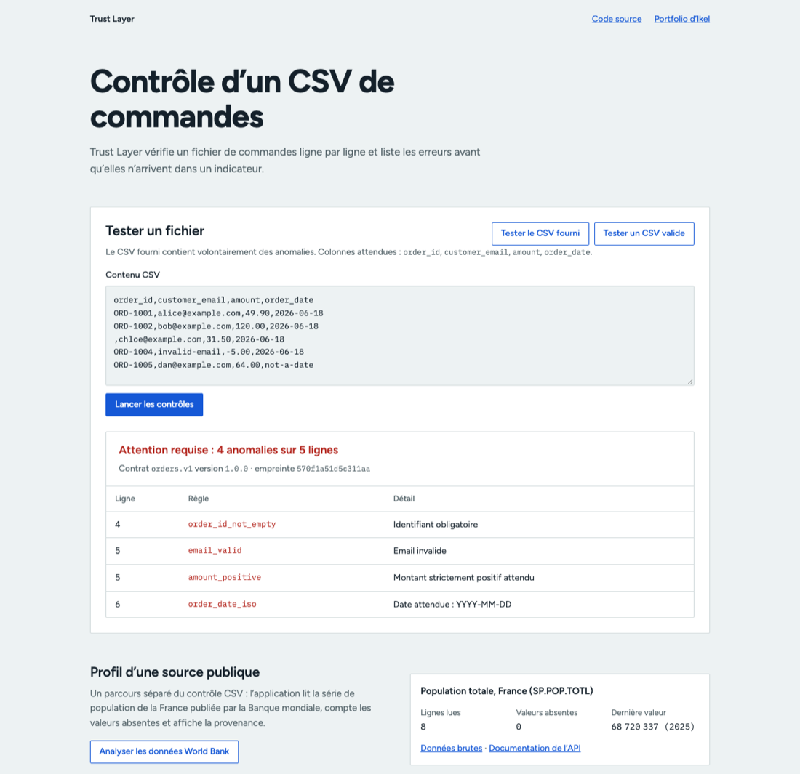

# Trust Layer

Trust Layer contrôle un CSV de commandes ligne par ligne et liste les erreurs avant qu’elles n’alimentent un reporting ou une décision. Démo : https://trust-layer-ikel-vt39.onrender.com



La capture montre le rapport sur le CSV fourni (4 anomalies sur 5 lignes, contrat `orders.v1`) et, en bas, le profil d’une série publique de population.

## Test en moins d’une minute

Lance l’application, ouvre `http://localhost:8000`, puis clique sur **Tester le CSV fourni**. Le chargement et les contrôles se font dans le même geste. Le fichier `data/orders.csv` contient volontairement plusieurs anomalies. **Tester un CSV valide** montre le cas sans erreur.

Le bouton **Analyser les données World Bank** appelle `GET /api/open-data/world-bank`, qui lit la population totale de la France (`SP.POP.TOTL`), compte les valeurs absentes et renvoie la provenance. Ce parcours est séparé du contrôle métier : si la source publique ne répond pas, le contrôle CSV reste utilisable.

## Ce qui fonctionne

- vérification du schéma exact, des identifiants, emails, montants strictement positifs et dates ;
- rapport JSON et Markdown en ligne de commande ;
- code de sortie 1 si une règle bloquante échoue ;
- contrat `orders.v1` versionné, empreinte du contenu analysé et synthèse des règles en échec dans chaque réponse de l’API.

```bash
python3 src/server.py
```

Ouvrir ensuite `http://127.0.0.1:8000`, charger un exemple ou coller un CSV. L’API est aussi disponible via `POST /api/check` avec le contenu CSV comme corps de requête.

`GET /api/contracts/orders` expose le contrat utilisé par l’interface. `POST /api/check` retourne la version du contrat et une empreinte de la source, ce qui rattache un résultat de contrôle au fichier exact analysé.

## Ligne de commande

```bash
python3 src/run_quality.py
```

La commande écrit `out/report.json` et `out/report.md`, et sort avec le code 1 si des erreurs bloquantes sont trouvées.

## Docker et Render

```bash
docker build -t trust-layer .
docker run --rm -p 8000:8000 trust-layer
```

`render.yaml` décrit le déploiement sur Render (Blueprint, offre gratuite).

## Vérifier

```bash
python3 -m unittest discover -s tests
```

## Limites

Le contrat ne couvre qu’un format de commandes à quatre colonnes ; un autre schéma demande de modifier le code.
Le fichier est lu en entier en mémoire, sans limite de taille côté serveur, ce qui convient à une démo et pas à de gros volumes.
